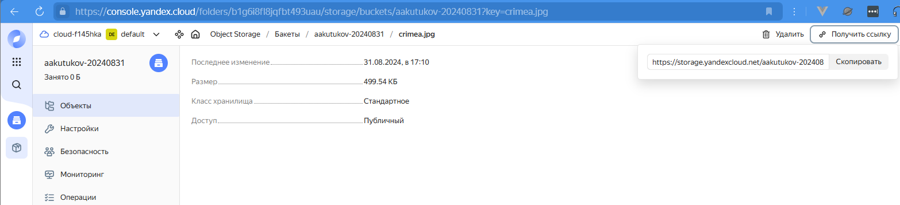
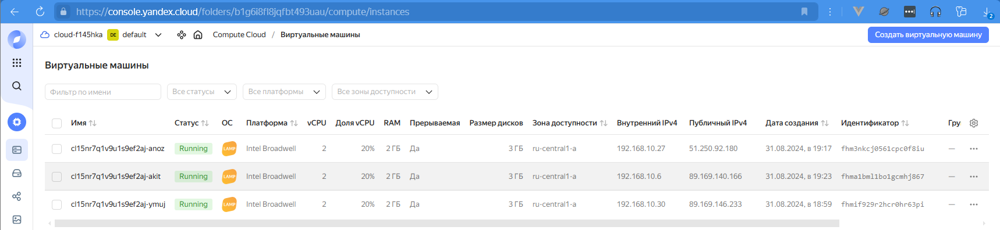
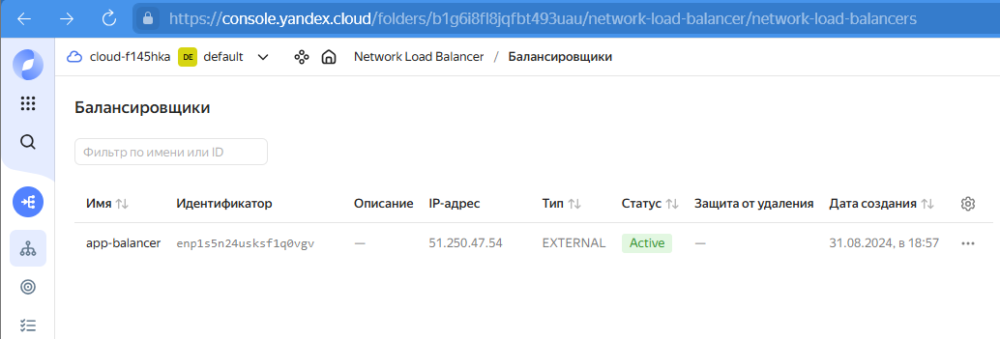
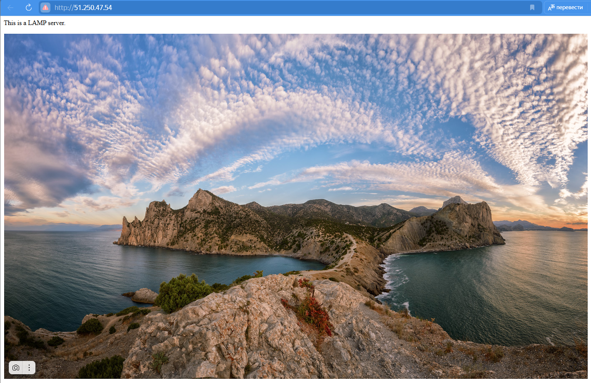

# Домашнее задание к занятию «Вычислительные мощности. Балансировщики нагрузки»  

### Подготовка к выполнению задания

1. _Домашнее задание состоит из обязательной части, которую нужно выполнить на провайдере Yandex Cloud, и дополнительной части в AWS (выполняется по желанию)._   
2. _Все домашние задания в блоке 15 связаны друг с другом и в конце представляют пример законченной инфраструктуры._    
3. _Все задания нужно выполнить с помощью Terraform. Результатом выполненного домашнего задания будет код в репозитории._   
4. _Перед началом работы настройте доступ к облачным ресурсам из Terraform, используя материалы прошлых лекций и домашних заданий._  

---
## Задание 1. Yandex Cloud 

**Что нужно сделать**

1. _Создать бакет Object Storage и разместить в нём файл с картинкой:_  

 - _Создать бакет в Object Storage с произвольным именем (например, _имя_студента_дата_)._  
 - _Положить в бакет файл с картинкой._  
 - _Сделать файл доступным из интернета._  

  
  

2. _Создать группу ВМ в public подсети фиксированного размера с шаблоном LAMP и веб-страницей, содержащей ссылку на картинку из бакета:_  

 - _Создать Instance Group с тремя ВМ и шаблоном LAMP. Для LAMP рекомендуется использовать `image_id = fd827b91d99psvq5fjit`._  
 - _Для создания стартовой веб-страницы рекомендуется использовать раздел `user_data` в [meta_data](https://cloud.yandex.ru/docs/compute/concepts/vm-metadata)._  
 - _Разместить в стартовой веб-странице шаблонной ВМ ссылку на картинку из бакета._  
 - _Настроить проверку состояния ВМ._  

  
 
3. _Подключить группу к сетевому балансировщику:_  

 - _Создать сетевой балансировщик._  
 - _Проверить работоспособность, удалив одну или несколько ВМ._  
4. _(дополнительно)* Создать Application Load Balancer с использованием Instance group и проверкой состояния._  

  
  

_Полезные документы:_  

- _[Compute instance group](https://registry.terraform.io/providers/yandex-cloud/yandex/latest/docs/resources/compute_instance_group)._  
- _[Network Load Balancer](https://registry.terraform.io/providers/yandex-cloud/yandex/latest/docs/resources/lb_network_load_balancer)._  
- _[Группа ВМ с сетевым балансировщиком](https://cloud.yandex.ru/docs/compute/operations/instance-groups/create-with-balancer)._  

---
## Задание 2*. AWS (задание со звёздочкой)

_Это необязательное задание. Его выполнение не влияет на получение зачёта по домашней работе._  

**Что нужно сделать**

_Используя конфигурации, выполненные в домашнем задании из предыдущего занятия, добавить к Production like сети Autoscaling group из трёх EC2-инстансов с  автоматической установкой веб-сервера в private домен._  

1. _Создать бакет S3 и разместить в нём файл с картинкой:_  

 - _Создать бакет в S3 с произвольным именем (например, _имя_студента_дата_)._  
 - _Положить в бакет файл с картинкой._  
 - _Сделать доступным из интернета._  
2. _Сделать Launch configurations с использованием bootstrap-скрипта с созданием веб-страницы, на которой будет ссылка на картинку в S3._   
3. _Загрузить три ЕС2-инстанса и настроить LB с помощью Autoscaling Group._  

_Resource Terraform:_

- _[S3 bucket](https://registry.terraform.io/providers/hashicorp/aws/latest/docs/resources/s3_bucket)_  
- _[Launch Template](https://registry.terraform.io/providers/hashicorp/aws/latest/docs/resources/launch_template)._  
- _[Autoscaling group](https://registry.terraform.io/providers/hashicorp/aws/latest/docs/resources/autoscaling_group)._  
- _[Launch configuration](https://registry.terraform.io/providers/hashicorp/aws/latest/docs/resources/launch_configuration)._  

_Пример bootstrap-скрипта:_  

```
#!/bin/bash
yum install httpd -y
service httpd start
chkconfig httpd on
cd /var/www/html
echo "<html><h1>My cool web-server</h1></html>" > index.html
```
### Правила приёма работы

_Домашняя работа оформляется в своём Git репозитории в файле README.md. Выполненное домашнее задание пришлите ссылкой на .md-файл в вашем репозитории._  
_Файл README.md должен содержать скриншоты вывода необходимых команд, а также скриншоты результатов._  
_Репозиторий должен содержать тексты манифестов или ссылки на них в файле README.md._  