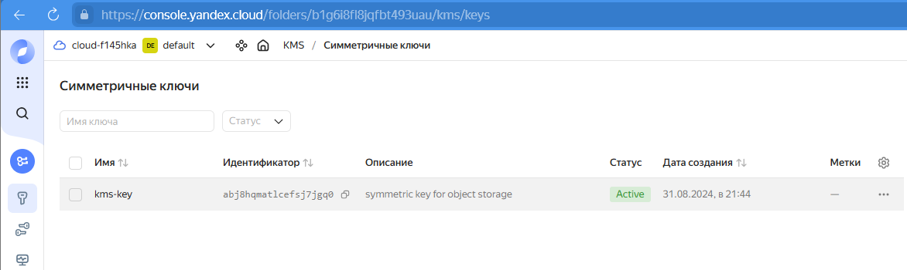
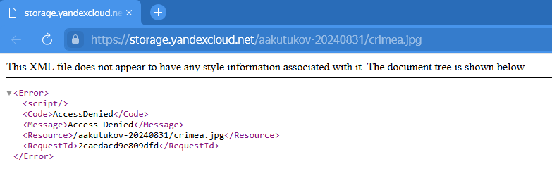

# Домашнее задание к занятию «Безопасность в облачных провайдерах»  

Используя конфигурации, выполненные в рамках предыдущих домашних заданий, нужно добавить возможность шифрования бакета.

---
## Задание 1. Yandex Cloud   

1. _С помощью ключа в KMS необходимо зашифровать содержимое бакета:_  

 - _создать ключ в KMS;_  
  


 - _с помощью ключа зашифровать содержимое бакета, созданного ранее._  
  
  
  
2. _(Выполняется не в Terraform)* Создать статический сайт в Object Storage c собственным публичным адресом и сделать доступным по HTTPS:_  

 - _создать сертификат;_  
 - _создать статическую страницу в Object Storage и применить сертификат HTTPS;_  
 - _в качестве результата предоставить скриншот на страницу с сертификатом в заголовке (замочек)._  

_Полезные документы:_

- _[Настройка HTTPS статичного сайта](https://cloud.yandex.ru/docs/storage/operations/hosting/certificate)._  
- _[Object Storage bucket](https://registry.terraform.io/providers/yandex-cloud/yandex/latest/docs/resources/storage_bucket)._  
- _[KMS key](https://registry.terraform.io/providers/yandex-cloud/yandex/latest/docs/resources/kms_symmetric_key)._  

--- 
## Задание 2*. AWS (задание со звёздочкой)

_Это необязательное задание. Его выполнение не влияет на получение зачёта по домашней работе._  

**Что нужно сделать**

1. _С помощью роли IAM записать файлы ЕС2 в S3-бакет:_  
 - _создать роль в IAM для возможности записи в S3 бакет;_  
 - _применить роль к ЕС2-инстансу;_  
 - _с помощью bootstrap-скрипта записать в бакет файл веб-страницы._  
2. _Организация шифрования содержимого S3-бакета:_  

 - _используя конфигурации, выполненные в домашнем задании из предыдущего занятия, добавить к созданному ранее бакету S3 возможность шифрования Server-Side, используя общий ключ;_  
 - _включить шифрование SSE-S3 бакету S3 для шифрования всех вновь добавляемых объектов в этот бакет._  

3. _*Создание сертификата SSL и применение его к ALB:_  

 - _создать сертификат с подтверждением по email;_  
 - _сделать запись в Route53 на собственный поддомен, указав адрес LB;_  
 - _применить к HTTPS-запросам на LB созданный ранее сертификат._  

_Resource Terraform:_

- _[IAM Role](https://registry.terraform.io/providers/hashicorp/aws/latest/docs/resources/iam_role)._  
- _[AWS KMS](https://registry.terraform.io/providers/hashicorp/aws/latest/docs/resources/kms_key)._  
- _[S3 encrypt with KMS key](https://registry.terraform.io/providers/hashicorp/aws/latest/docs/resources/s3_bucket_object#encrypting-with-kms-key)._  

_Пример bootstrap-скрипта:_  

```
#!/bin/bash
yum install httpd -y
service httpd start
chkconfig httpd on
cd /var/www/html
echo "<html><h1>My cool web-server</h1></html>" > index.html
aws s3 mb s3://mysuperbacketname2021
aws s3 cp index.html s3://mysuperbacketname2021
```

### Правила приёма работы

_Домашняя работа оформляется в своём Git репозитории в файле README.md. Выполненное домашнее задание пришлите ссылкой на .md-файл в вашем репозитории._  
_Файл README.md должен содержать скриншоты вывода необходимых команд, а также скриншоты результатов._  
_Репозиторий должен содержать тексты манифестов или ссылки на них в файле README.md._  