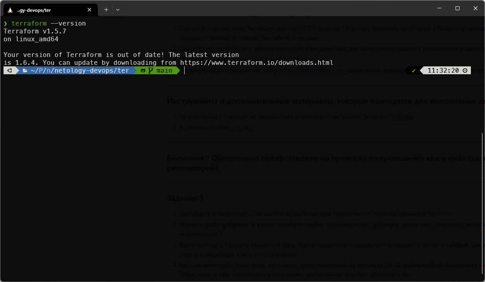
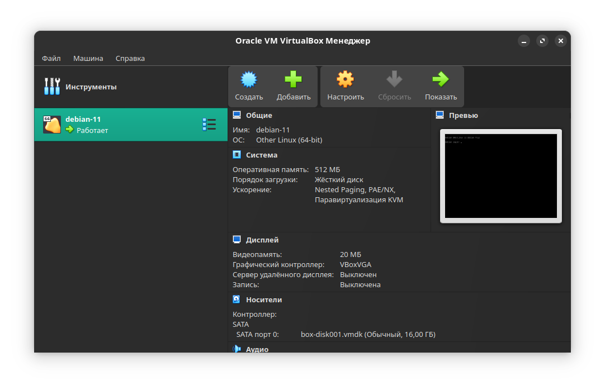

  

### Задание 1
1. _Перейдите в каталог src. Скачайте все необходимые зависимости, использованные в проекте._  
   +
2. _Изучите файл .gitignore. В каком terraform-файле, согласно этому .gitignore, допустимо сохранить личную, секретную информацию?_  
  
   Личную информацию можно хранить в файле `personal.auto.tfvars`
3. _Выполните код проекта. Найдите в state-файле секретное содержимое созданного ресурса random_password, пришлите в качестве ответа конкретный ключ и его значение._  
  
   `"result": "arOvqjB12SAtubuC",`  
4. _Раскомментируйте блок кода, примерно расположенный на строчках 29–42 файла main.tf. Выполните команду terraform validate. Объясните, в чём заключаются намеренно допущенные ошибки. Исправьте их._  
   * Имя должно начинаться с буквы или символа подчеркивания. В коде имя начиналось с цифры.
   * Блок ресурса должен содержать минимум 2 аргумента (метки): тип и имя. В коде имя было не объявлено.
   * Ресурса `random_string_fake` не существует в модуле `random_password`. Исправил на `random_string`.
   * Большая буква в атрибуте `resulT`. Исправил на `result`
5. _Выполните код. В качестве ответа приложите: исправленный фрагмент кода и вывод команды docker ps._  
```
resource "docker_image" "nginx"{
  name         = "nginx:latest"
  keep_locally = true
}

resource "docker_container" "nginx_1" {
  image = docker_image.nginx.image_id
  name  = "example_${random_password.random_string.result}"

  ports {
    internal = 80
    external = 8000
  }
}
```
```
❯ docker ps  
CONTAINER ID   IMAGE          COMMAND                  CREATED              STATUS              PORTS                  NAMES  
d5b28532878a   a6bd71f48f68   "/docker-entrypoint.…"   About a minute ago   Up About a minute   0.0.0.0:8000->80/tcp   example_arOvqjB12SAtubuC
```
6. _Замените имя docker-контейнера в блоке кода на hello_world. Не перепутайте имя контейнера и имя образа. Мы всё ещё продолжаем использовать name = "nginx:latest". Выполните команду terraform apply -auto-approve. Объясните своими словами, в чём может быть опасность применения ключа -auto-approve. Догадайтесь или нагуглите зачем может пригодиться данный ключ? В качестве ответа дополнительно приложите вывод команды docker ps._  
  
   Параметр `-auto-approve` используется для автоматизации, но опасен тем, что администратор не может окончательно проверить код перед применением.
```
❯ docker ps
CONTAINER ID   IMAGE          COMMAND                  CREATED         STATUS         PORTS                  NAMES
8ec4af9f4dc9   a6bd71f48f68   "/docker-entrypoint.…"   9 seconds ago   Up 8 seconds   0.0.0.0:8000->80/tcp   hello_world
```
7. _Уничтожьте созданные ресурсы с помощью terraform. Убедитесь, что все ресурсы удалены. Приложите содержимое файла terraform.tfstate._  
```
{
  "version": 4,
  "terraform_version": "1.5.7",
  "serial": 11,
  "lineage": "91ea6d38-a699-b569-9a98-ae92a7638b19",
  "outputs": {},
  "resources": [],
  "check_results": null
}
```
8. _Объясните, почему при этом не был удалён docker-образ nginx:latest. Ответ обязательно подкрепите строчкой из документации terraform провайдера docker. (ищите в классификаторе resource docker_image )_
  
   Образ не был удален из-за использования параметра `keep_locally = true`.  
   `keep_locally` (Boolean) If true, then the Docker image won't be deleted on destroy operation. If this is false, it will delete the image from the docker local storage on destroy operation.

### Задание 2
```
❯ terraform plan

Terraform used the selected providers to generate the following execution plan. Resource actions are indicated with the following symbols:
  + create

Terraform will perform the following actions:

  # virtualbox_vm.vm1 will be created
  + resource "virtualbox_vm" "vm1" {
      + cpus   = 1
      + id     = (known after apply)
      + image  = "https://app.vagrantup.com/shekeriev/boxes/debian-11/versions/0.2/providers/virtualbox.box"
      + memory = "512 mib"
      + name   = "debian-11"
      + status = "running"

      + network_adapter {
          + device                 = "IntelPro1000MTDesktop"
          + host_interface         = "vboxnet0"
          + ipv4_address           = (known after apply)
          + ipv4_address_available = (known after apply)
          + mac_address            = (known after apply)
          + status                 = (known after apply)
          + type                   = "hostonly"
        }
    }

Plan: 1 to add, 0 to change, 0 to destroy.

Changes to Outputs:
  + IPAddress = (known after apply)

───────────────────────────────────────────────────────────────────────────────────────────────────────────────────────────────────────────────────────────────────────────────────────────

Note: You didn't use the -out option to save this plan, so Terraform can't guarantee to take exactly these actions if you run "terraform apply" now.
```  
Я поймал [баг](https://github.com/terra-farm/terraform-provider-virtualbox/issues/134) в этом задании. Решить не смог. Машина деплоится, но terraform не может получить ip-адрес. Пробовал разные типы сетей. Машина доступна, но terraform падает с ошибкой.  

